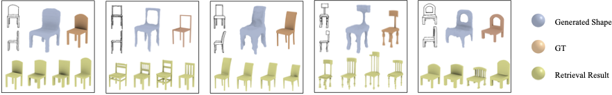

# Towards Practical Sketch-Based 3D Shape Generation.

## Contents

- [Introduction](#Introduction)
- [Requirements](#Requirements)
- [Download Dataset](#Download-Dataset)
- [Results](#Results)

## Introduction

This repository contains the Pytorch implementation of [Towards Practical Sketch-Based 3D Shape Generation](https://ieeexplore.ieee.org/document/9272370). 

You can find detailed usage instructions for training and evaluation below.

 If you use our code or dataset, please cite our work:

    @ARTICLE{sketch3d2020,
        author={Zhong, Yue and Qi, Yonggang and Gryaditskaya, Yulia and Zhang, Honggang and Song, Yi-Zhe},
        journal={IEEE Transactions on Circuits and Systems for Video Technology}, 
        title={Towards Practical Sketch-Based 3D Shape Generation: The Role of Professional Sketches}, 
        year={2021},
        volume={31},
        number={9},
        pages={3518-3528},
        doi={10.1109/TCSVT.2020.3040900}
    }

## Requirements

First you have to make sure that you have all dependencies in place.
The simplest way to do so, is to use [anaconda](https://www.anaconda.com/). 
sss
Please refer the README file in each sub-task for detailed instruction.
s
## Download Dataset

Download dataset is easy. Directly download from [Dataset](https://pan.baidu.com/s/1wpf6Tc7h55TN6bdUYXQsPQ) with code: fhp7.

Most of our experiments are conducted on the modelsfrom a chair category of the ShapeNetCore V2. We selected these categories guided by the next principles: 1) Easy to sketch. 2) Generality. 3) View differentiability. 4) Shape genius higher than 1. 5) Large inter-category variance. We generate three categories with distinctive styles, whichwe refer to as naive, stylized and style-unified. Please refer paper for further details.

## Results

We show an improved performance of deep image modeling.

